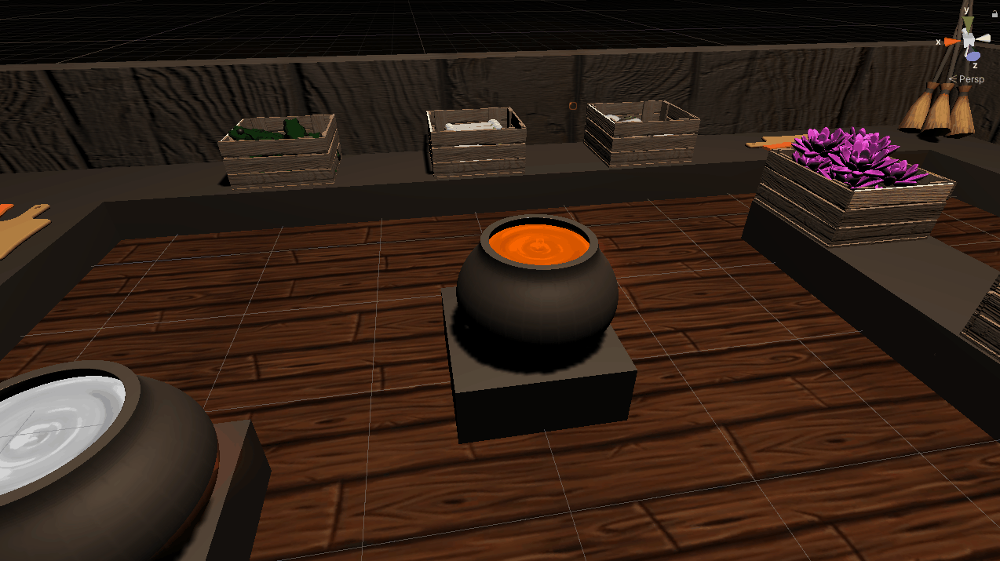

**The University of Melbourne**

# COMP30019 – Graphics and Interaction

## Table of contents
* [Team Members](#team-members)
* [Introduction](#introduction)
* [How to Play](#how-to-play)
* [Modelling of Objects and Entities](#modelling-of-objects-and-entities)
* [Camera Motion and Graphics Pipeline](#camera-motion-and-graphics-pipeline)
* [Shaders and Particle Systems](#shaders-and-particle-systems)
* [Evaluation Methods](#evaluation-methods)
* [Evaluation and Changes Implemented](#evaluation-and-changes-implemented)
* [Resource References](#resource-references)
* [Individual Contributions](#individual-contributions)


## Team Members

| Name | Task | State |
| :---         |     :---:      |          ---: |
| Arriken Worsley  | Scenes/Models     |  Done |
| Joel Kenna    | Game Logic      |  Done |
| Simon Tran  | Game Logic      |  Done |
| Iris Li  | UI      |  Done |


## Introduction

Underbrewed is a single-player cooking simulator game in which players brew potions according to incoming orders. Players must collect and prepare ingredients, then add them to a cauldron in a sequence specified in each order. Players should follow each recipe carefully - adding the wrong ingredient to a cauldron or delivering an invalid potion triggers special effects and obstacles to distract players. To earn points, players must bottle up and deliver each potion before the order expires. Players should aim to improve their high score by completing as many orders as possible within the level's time limit.

Underbrewed uses a static camera and third person perspective, and is designed to be played with a keyboard.

Watch the gameplay trailer [here](https://www.youtube.com/watch?v=fE1b38sGNSU&feature=youtu.be).

## How to Play
### Basic controls
- Movement: WASD and arrow keys are both supported
- Pick up item: Press ‘M’ while facing an item
- Drop item: Press ‘M’ again while holding an item
- Throw item: Press ‘.’ While holding an item
- Interact with station: Press ‘,’ while facing the station
- Fill potion from cauldron: Press ‘,’ while holding a bottle and facing a cauldron
- Open pause menu: Press ‘Esc’
- The optional key sets "O", "P", "[" and "Z", "X", "C" can be used instead of the default "M", ",", "."

### Loading the Game
To load the game, navigate to the `MainMenu` scene which can found at the path: `Assets\Scenes\EvaluationBuild\MainMenu.unity`. Open the scene and press play to play the game.

### Menus
#### Main Menu
* The `Tutorial` button loads the tutorial level for the game
* The `Play Game` button opens the level select scene for the game
* The `Quit` button closes the game
#### Level Select Menu
Click on a level thumbnail to load a specific level. Highscores for levels are displayed below the level's thumbnail.
* The `Go Back` buttons loads the main menu scene for the game.
#### Pause Menu
The pause menu can be accessed by pressing the 'Esc' key during a level.
* The `Resume` button resume the level from the point it was paused.
* The `Restart` button loads the current level from start.
* The `Quit` button loads the main menu scene for the game.
#### End Game Menu
The end game menu is displayed once a player finishes a leve. In the middle it displays if the player passed or failed the level, with more details on the right hand side. These details include the player's score on this level, their grade for this level as well as the current high score for this level.
* The `Next Level` button loads the next level of the game.
* The `Retry` button loads the current level from the start.
* The `Quit` button loads the main menu scene for the game.

### Gameplay
Throughout a level, orders will continually arrive in the top left of the screen. Each order contains a potion, the ingredients needed to brew the potion, and a timer that indicates how long the player will have to complete the order.

To create a potion, players must place ingredients into cauldrons in the order they appear on the recipe. If an ingredient has an icon beneath it, the player must first process the ingredient at a corresponding station before adding it to a cauldron.

<p align="center">
  
</p>

In the image of an order above, the timer is represented by the horizontal green bar at the top of the order. As shown on the left, the final colour of this order is an orange potion. Finally the ingredients for this potion are shown in order from left to right. To create this potion, the player must add a burnt frog, a crush bone and a crushed eye to a cauldron in that order.

<p align="center">
  

	Pictured: The final ingredient is added to a potion, triggering a colour change
</p>

To deliver a completed potion, players must fill a bottle with liquid from the cauldron they have brewed the potion in, then must drop or throw the bottled potion through the delivery portal. Each successful delivery will increase the players’ score, which is displayed in the lower right of the screen. The time left until the level ends is displayed below the score.

<p align="center">
  

	Pictured: A potion is collected from a cauldron using the interact button while holding a potion
</p>

<p align="center">
  

	Pictured: A potion is delivered using the portal
</p>

If a player places an ingredient into the cauldron that does not match any valid potions, the game will trigger a special effect to distract players, such as a shader to distort the screen, or an explosion that sends ingredients flying across the scene.

Later levels become more difficult and the player must rely on multitasking and item throwing to complete order on time.

<b> We recommend that new players play our tutorial level before attempting stages, as it provides an in-depth overview of the game’s controls and mechanics. </b>


## Modelling of Objects and Entities
We split our Unity Game Objects within our scenes into five distinct categories: Player Object, Interactable Objects, Decorative Objects, UI Elements, and Game Managers.

### Player Object
Player Object refers to the Game Object with a tangible form that is controlled by the player through controller inputs. These inputs and their subsequent effect are handled by a C# Script. This object has a mesh, collider, and rigidbody to allow for it to interact physically with other objects in the scene through Unity's Physics Engine. Furthermore, this object has multiple child objects to represent physical features of the player as well as to provide additional functionality. 
* Of note is the Pickup Collider object child which handles all the logic of picking up, dropping, throwing, and moving held items via a C# Script. It defines the space where the player will search for objects to interact with.
* There are also child objects which represent different items the Player Object can "hold" for visual purposes. For example, the Player Object has a Knife child which is disabled until it interacts with a Chopping Board. When it interacts, the Knife object enables and can be seen in the Player Object's hand.   


### Interactable Objects
Interactable Objects refer to the Game Objects with a tangible form within our scenes that have logic provided by a C# Script and could be interacted with in some way by the player. We provided each of these objects with a main script that described the core logic of the object as well as act as an identifier for the type of Interactable this object was. This was modelled with an Inheritance system so that we could make use of polymorphism and reuse code much more seamlessly which made our codebase both easier to read and quicker to develop on.

The Inheritance Tree for C# Scripts/Classes assigned to Interactable Objects present in our final build is as follows:
- Interactable
	- Item
		- Ingredient
			- Single Material Ingredient
		- Potion
	- Station
		- Cauldron
		- Bin
		- Portal
		- Processor
			- Toggle Processor
			- Hold Processor

A further explanation of what functionality each class provides/represents is as follows:
|          C# Class          | Functionality given to Game Object                                                                                                            |
|:--------------------------:|-----------------------------------------------------------------------------------------------------------------------------------------------|
| Interactable               | Gets highlighted when focused on by the Player Object. Has a Collider for Physics and a Renderer.                                                                                    |
| Item                       | Can be picked up, dropped, thrown, and stored by other objects including the Player Object. Has a Rigidbody.       |
| Station                    | Can retrieve and store nearby. Has a second Collider for Triggers Items                                                                                                           |
| Ingredient                 | Holds an ingredient type for identification by other objects                                                                                  |
| Potion                     | Can collect Cauldron contents and has unique interactions with various Stations                                                               |
| Cauldron                   | Records retrieved Ingredients and refers to Game Managers to output a state                                                                   |
| Bin                        | Destroys retrieved Items                                                                                                                      |
| Portal                     | Retrieves Potions and passes information to Game Managers                                                                                     |
| Processor                  | Transforms an Ingredient into another Ingredient variant                                                                                      |
| Toggle Processor           | Transforms Ingredients over time via a toggle                                                                                                 |
| Hold Processor             | Transforms Ingredients over time via holding down a button                                                                                    |
| Single Material Ingredient | Less computationally expensive alternative to Ingredient for when the Game Object only has one Material (including any child/sibling objects) |

### Game Managers
Game Managers refer to Game Objects that are present in the scene only to hold and instantiate C# Scripts that are attached to them. These objects do not have a physical form (i.e. No mesh, no renderer, no collider, etc) and are used to direct and control gameplay and UI flow. Examples used within our system include:
- The Game Controller, which handles the core game logic. The controller:
	- Manages and stores active and enqueued orders
	- Handles logic for processing delivered orders
	- Stores and updates game time and scores
	- Triggers start and end level events.
- The Tutorial Controller, which carries out the interactive progression of tutorial stages. The tutorial:
	- Handles logic for automatic advancement on the successful completion of actions
	- Manages the the display and repositioning of tutorial messages and captions
- The Recipe Tree, which holds stores our recipe tree as a tree data structure, and has methods for checking the validity of ordered lists of ingredients. It acts as the source of truth for our recipes.
<p align="center">
  

	Pictured: An early design plan for our recipe tree
</p>

### Decorative Objects
Decorative Objects refer to the Game Objects with a tangible form within in our scene that do not have any C# Scripts and are primarly used for decorative purposes. Where necessary, these objects have colliders to prevent the Player Object and Interactable Objects from moving past them. Some examples of these are:
- Tables, Walls, and other objects that compose the boundaries of the playable space
- Decorative elements like Broomsticks, Flower Pots
- All objects that lie outside of the playable area

### UI Elements
UI Elements refer to the 2D Game Objects that appear in the Player Camera's field of view. They are used to provide the user with a visual interpretation of the state of the game logic. Some examples of these are:
- Incoming orders
- Score and time remaining indicators
- The various menu elements that compose our level select, main menu, and pause menu screens.

A canvas prefab, UIMain, contained the game objects and scripts for all UI elements within each level, including
- OrderQueue
  - Orders were used to display tasks that needed to be completed by the player. Each order consisted of a timer bar, a potion sprite, and up to six sprites which detailed the recipe (up to 3 ingredients and methods)
  - Separate scripts were used to manage the addition and deletion of active orders from a queue, and update the individual timer of each order
- ProgressBarManager
  - Progress bars were implemented to show the progression of processing by a station, such as the burning station or chopping station
  - Each progress bar was transformed according to a station's position, the time required for processing an ingredient, and if the ingredient was actively being processed at the station
  - A script was used to manage the active state of the progress bar
- UIPauseMenu
  - A pause menu was implemented to allow players to pause, restart, or quit the level whenever the game timer is active
- UIEndScreen
  - An end screen was also implemented to display the final score at the end of the level, as well as a grade value and the highest score achieved for that level
  - It also allows the player to restart the level, progress to the next level, or quit to the main menu
- GameTimer and GameScore
  - The game timer and game score elements display the time remaining in the level, and the current score
- GameText
  - Displays "3, 2, 1, go!" at the start of each level


## Camera Motion and Graphics Pipeline
### Camera Motion

#### Static Camera
The game is primarily played with a static camera. The camera is placed high above the level, similar to a bird's eye view, allowing the player to see everything as the play they game. This camera position was chosen as it made the entire level viewable for the player while avoiding the issues of traditional cameras, such as occlusion.
<p align="center">
  
</p>

#### Action Replay Camera
When a level finishes, an "action replay" occurs, with the camera moving down towards the player and focusing on them to produce the end game screen. The camera will always approach from the opposite quarter of the level to the player in order to avoid occlusion from the level's walls.
<p align="center">
  
</p>


### Graphics Pipeline

The majority of the graphical work within our game is carried out by the GPU, which handles our lighting, special effects, and texture mapping. While the CPU plays a less significant role, it is still highly important, as it is used by Unity to provide vertices, textures, and commands to the GPU.

#### Geometry shaders
While our game doesn't contain any custom geometry shaders, the particle systems we use to create in-game effects are built using Unity's particle system functionality, which makes heavy use of geometry shaders to construct quads based on particle vertices. In our game, these systems include:
* Bubble particle systems
* Flame particle systems
* Smoke particle systems

#### Fragment shaders
Our game makes heavy use of custom and Unity-provided fragment shaders to handle lighting and effects. Our choice to use shaders to create these effects was based on their ability to exploit the GPU's ability to efficiently perform simple tasks in parallel, which allows us to efficiently compute effects across our scene. As our fragment shaders apply simple functions on a per pixel basis every frame, there possibly millions of simple calculation which must be done every frame. Because of this, it is much quicker to do these calculations in parallel on the gpu. Although our shaders are implementable on the cpu via scripts, the lack of parallelisation would drastically affect the frame rate of our game. Some examples of our uses of fragment shaders include:

* Unity’s lighting shaders are used throughout our scenes in order to provide realistic lighting.
* A custom fragment shader is used to creating a rich swirling effect for our menu backgrounds and cauldron contents.
* A custom fragment shader is used to provide interesting colouring for our flame effects.

#### Post-processing
After the initial render is complete, a custom fragment shader is applied to the initial render texture to provide post-processing effects and generate the final render texture, with this post-processing being triggered using Unity's ```OnRenderImage()``` functionality. Once again, our motivation for using a shader to apply this effect is rooted in the GPU's ability to efficiently perform parellelized processing - as a simple effect is applied across the entire screen, a GPU based approach yields great performance improvements over a CPU based approach. We have provided a sample of our code for applying post-processing shaders below:

```C#
    void OnRenderImage(RenderTexture source, RenderTexture destination)
    {
        if (applyAffect)
        {
            Graphics.Blit(source, destination, material);
        }
        else
        {
            Graphics.Blit(source, destination);
        }
    }
```

## Shaders and Particle Systems

### Potion Liquid Shader
The potion liquid shader produces a swirling liquid, with the liquid slowly falling towards the center. This shader was used for the cauldron liquid, the portal center, as well as the backgrounds for the menus. The shader was produced with help from an online tutorial found [here](http://enemyhideout.com/2016/08/creating-a-whirlpool-shader/).
<p align="center">
  
</p>

The first part of the shader is the function rotate, which rotates a point around the center by `rotationAmount` radians. This was done by coverting the initial cartesian point into a polar co-ordinates, increasing the angle by `rotationAmount` radians, and returning the point converted back into a cartesian point.
```Shaderlab
// rotates a point
float2 rotate( float rotationAmount, float2 p)
{
	float a = atan2(p.y, p.x);
	float r = length(p);

	a += rotationAmount;

	return float2(cos(a) * r, sin(a) * r);
}
```
The input uv point is first converted to be relative to the center of the uv texture, then rotated twice with the rotation function. The first rotation rotates all points by a fixed amount, while the latter rotates the points based off a mask called `motion`. This mask increases the rotation speed based of the alpha value of the mask, making the further out points rotate faster.
```Shaderlab
// find point position relative to middle of uv
float2 p = i.uv - float2(0.5, 0.5);

// if point is outside the circle, render it transparent
if (length(p) > 0.5)
{
	return fixed4(0, 0, 0, 0);
}

// For rotation

// _Swirl is general swirl amount, motion.r increases swirl amount the further out it is
p = rotate(_Rotation * _Time * _Speed, p);
p = rotate(_Swirl * (motion.a * _Time), p);
```
Finally, the rotated point is used to calculate the uv point, which is multiplied by the colour to find the final colour output. The x value of the uv is based of time offset by the inverse of the radius of the rotated point. This produces the effect the liquid falling into the center. The y value of the uv is based of the angle of the rotated point. This gives the shader the circular texture from the initial straight vertical texture.
```Shaderlab
// For texture moving towards center
float2 uv;

uv.x = (_Time[0] * _Speed) - (1 / (length(p) + _Swirliness));
// angle of new point
float a = atan2(p.y, p.x);
// divide angle by two pi to get angle in radians scaled to between 0-1
uv.y = a/(3.1416 * 2);

// Now we can get our color.
fixed4 fragColor = tex2D(_MainTex, uv) * _Color;

return fragColor;
```

### Screen Distortion Shader

The screen distortion shader produces a distorted, green hued image. The shader is used as a post-processing effect and is triggered by the player incorrectly brewing a potion.

<p align="center">
  
</p>

The core section of code used to create the screen motion / distortion effects is presented below. It has been split into more lines to improve readability. Default transformations like UnityObjectToClipPos are applied after this core logic.

```Shaderlab
//main effect
newX = (0.05 * sin(v.vertex.x + 1.5 * sin(_Time.z)) + v.vertex.x;
newY = (0.05 * sin(v.vertex.y + 2.5 * cos(_Time.z)) + v.vertex.y;
newVertex = (newX, newY, v.vertex.z, 1);
```

The internal trig functions ```sin(_Time.z)``` and ```cos(_Time.z)``` are used to create a screen shake effect. The choice of using different trig functions on each axis was to ensure the screen shake didn't simply slide along a line (which would occur if the same trig functions were used on both axes). The outermost sin function was used to create a stretching / warping effect across the entire image, producing a mild sense of disorientation. Finally, to ensure the final image largely remains centred and intelligible, the distortion effect is scaled down significantly before being added to the original vertex information, causing the effect to only have a moderate impact on the final image.  

The critical code for selecting the final colouring of the image is provided below:

```Shaderlab
fixed4 textureCol = tex2D(_MainTex, i.uv);

//cyclically change hue intensity
fixed4 greenCol = green * abs(sin(_Time.z));
fixed4 finalCol = 0.6 * textureCol + 0.2 * greenCol + 0.2 * green;

```
A greenish colouration is applied to the screen by retrieving the texture colour of the final image and then mixing it with a static green colour and a green colour whose strength varies with sine of the current time, resulting in a green hued image with an intensity that varies over time.

Implementing this effect using a shader is more performant than a CPU based approach. This is because the effect is applied uniformly across the render texture without significant logical branching, allowing it to take advantage of the GPU's ability to effciently parallelise simple operations.  

### Bubbles Particle System
The bubble effect produced by the cauldron is comprised of two different particle systems: Once that produces the intial bubble, and another that produces the popped bubble particles. The particle system was produced with help from a tutorial found [here](https://www.youtube.com/watch?v=ajsA6vWBhKI).

<p align="center">
  
</p>

The bubbles are emitted upwards from the cauldron's liquid surface, with their velocities changing over time, giving the bubbles a wavy effect as they rise up. When the bubbles expire after a certain lifetime, they emit the next particle system, representing the burst bubble. These burst bubble particles are affected by gravity are emitted in all directions from the expired bubble. This helps acheive the effect of a burst bubble.

### Fire particle system

<p align="center">
  
</p>

The fire of the cauldrons and burning stations were created using Unity’s Particle System API.

Each fire consisted of three particle systems of different sizes and colours. Using multiple particle systems helps to create the different “layers” of the fire (red, orange, and yellow sections).

The texture used for the fire particle system was created by Evgeny Starostin. The texture was implemented using a custom shader, based on Starostin's tutorial [here]((https://80.lv/articles/breakdown-magic-fire-effect-in-unity/),  and a texture sheet animation.

By default, Unity's built-in Particle Systems are applied by the CPU. This allows particle systems to interact with colliders within the scene. This was useful to ensure that the fire would not appear to pass through the cauldron or benches, and overall look more natural.


## Evaluation Methods

### Querying Method

#### Methodology
We used the interview querying method. Participants were sent an early version of the game, and instructed to play through a tutorial level and a game level on their own, without observation or input from the developer team. Players were invited to repeat either level as many times as they liked before taking part in an interview conducted over Zoom. The interview was recorded for future reference.

The interview consisted of open-ended questions surrounding the gameplay, graphics, and user experience. Participants were encouraged to form their own opinions of the game and discuss their feedback with the interviewer in a conversational style. Dot points and questions prepared by the interviewers were used to guide the discussion. The interviewers took typed notes during the interviews, and reviewed audio recordings of the interviews when necessary.

#### Participant demographic information
| Age | Gender   | Occupation                     | Self-estimate of hours of video games played per week |
|-----|--------  |--------------------------------|-------------------------------------------------------|
| 20  | Male     | 3rd year undergraduate student | 10                                                    |
| 20  | Female   | 3rd year undergraduate student | 2                                                     |
| 20  | Female   | 2nd year undergraduate student | 14                                                    |
| 19  | Male     | 1st year undergraduate student | 12                                                    |
| 18  | Female   | 1st year undergraduate student | 45                                                    |
| 18  | Male     | 1st year undergraduate student | 15                                                    |
| 18  | Female   | 1st year undergraduate student | 7                                                     |
| 19  | Female   | 1st year undergraduate student | 4                                                     |
| 20  | Female   | 2nd year undergraduate student | 2                                                     |

The demographic of participants was quite narrow, with all participants being between ages 18 and 20, and undertaking tertiary education. While levels of gaming experience varied between participants, all participants had some familiarity with gaming. The majority of participants reported playing between 0 and 15 hours of games per week. While a broader demographic in participants is generally desirable, we felt that the participants interviewed were able to use their previous gaming experience and expectations to provide relevant and insightful feedback.

#### Strengths and weaknesses of methodology
This querying method allowed participants to experience the game at their own pace and without influence from others. This method also gave participants time to reflect on their experience and concisely share their opinions. Some participants had even collated their own notes on their experience, and presented them during the interview. Participants feedback was useful in determining which aspects of the game were well-understood, and which aspects were considered pain points. However, some participants gave generic answers and struggled to recall or comment on certain elements of the game in detail when prompted. As interviewers were not present when participants were testing the game, interviewers were not able to fully capture or observe the participants' experience, or prompt participants to interact with certain elements of the game.


### Observational Method
#### Methodology
We used the “Think Aloud” observational method. Participants were invited to individually live-stream their playthrough of the tutorial and first stage to the examiners through a Discord channel. Examiners remained muted during the playthrough and did not communicate with the participants. Each playthroughs was observed in real time by the examiners and was recorded for future reference and evaluation.

<p align="center">
	

	Pictured: A screen capture from a "Think Aloud" observation session showing a user struggling to use a station.
</p>

#### Participant demographic information
| Age | Gender | Occupation                     | Self-estimate of hours of video games played per week |
|-----|--------|--------------------------------|-------------------------------------------------------|
| 21  | Male   | Doctor of Optometry student    | 16                                                    |
| 21  | Male   | 3rd year undergraduate student | 10                                                    |
| 20  | Male   | 2nd year undergraduate student | 40                                                    |
| 20  | Male   | 3rd year undergraduate student | 40                                                    |
| 21  | Male   | Unemployed                     | 30                                                    |


As with our interviews, the demographic breadth of participants for our "Think Aloud" evaluation was quite limited – all participants were male, were of similar ages, and were either university students or planning on undertaking tertiary studies, and this homogenity could limit our ability to accurately assess aspects of our game. However, as our game lacks a story or complex characters and is firmly grounded within a fantasy world, we expect these factors to have little bearing on how the game is played or perceived.

All participants had a high level of familiarity with video games, and this has both benefits and drawbacks - on one hand, this familiarity could cause our evaluation of our game to be biased, as users may have played similar games before and could use their prior knowledge to supplement sections of the game where goals or mechanics were not communicated clearly. On the other hand, this familiarity meant that we could easily identify where our game failed to meet the expectations of a typical “gamer” and target such areas for improvement.

#### Strengths and weaknesses of methodology
An area of weakness of our method was that the lack of a dialogue between the participant and examiners meant that feedback was mainly focused on the initial stumbling blocks users faced - in more collaborative methods (eg. cooperative evaluation), users can be moved forward, allowing for feedback to be provided across the entire game. However, as our users couldn't seek assistance to overcome areas of confusion, their feedback would often be limited to a subset of the game's mechanics and systems. As our tutorial was quite lacklustre when we performed our observations, we received limited feedback on later stages of the game.

However, a benefit of our method was that we were able to gain a better idea of the "blind" experience of a user, giving us insight into how the game would actually be played by a brand new player. This provided significant insight into the failings of our tutorial system, and helped us identify common user errors and misinterpreted/underutilized mechanics. The method was also simple to carry out, allowing us to allocate more time to development work.

## Evaluation and changes implemented

### Gameplay
* Overall, participants stated that they found the game enjoyable and relatively bug-free, with instructions clearly stating the objective of the game, and controls working as expected
* Some participants found that the game ran at a very low frame rate (20 to 30 fps)
	* We found that certain models had a extremely high vertex counts and shadow usage. These models were switched to alternate models with fewer vertices and shadows, yielding significant improvements to frame rate. One of our team members found that their fps doubled with this change. 
* The evaluation brought attention to several minor bugs, such as players glitching through certain benches and walls, player movement being disabled after restarting the game, and the ability to generate excessive amounts of ingredients by picking items from the crate in succession
	* These bugs were fixed for the final build of the game

### Instructions / tutorial level
* While this was mentioned in the tutorial, the majority of participants were not aware that ingredients had to be added to the cauldron in a particular order to be considered “correct”. Additionally, they were unaware that certain special effects (such as ingredients exploding) were the result of adding “incorrect” ingredients to the cauldron
	* The tutorial was reworked so that tips were clearer and more precise
	* An additional stage was added to the tutorial, in which players are instructed to make an “incorrect” potion to observe the special effects
* Participants reported mixed feelings about the tutorial level.
	* While the tutorial clearly explained the basic concepts of the game, participants felt that progression in the tutorial should be based on task completion, both to provide a sense of achievement for learning controls, and confirm that users were completing the task properly
		* The tutorial was reworked to progress based on task completion
	* Participants felt hindered by the need to always press the spacebar to continue to the next tip, and the inability to navigate back to a previous tip
		* We were unable to remove these challenges with the time given, but would like to have implemented these changes. However, due to much of the tutorial progression now being based on task completion, the need to press spacebar has been reduced. 
		* Players can restart the tutorial at any time by using the pause menu
<p align="center">
	

	Pictured: The reworked tutorial now prompts the user to complete certain tasks in order to advance to the next step.
</p>

### User experience
* Some participants felt confused by the different cauldron colours, as one of the potions was very similar in colour to the colour used to represent an “incorrect” potion
	* Potion colours were changed so that a black potion represented an “incorrect” potion
	* Grey colours were used to represent different stages of the potion in the cauldron, and a set of unique bright colours were used to represent each of the complete potions.
		* e.g. For recipes requiring three ingredients, placing the first ingredient would yield a light grey colour, placing the second ingredient would then yield a dark grey colour, and finally, placing the final ingredient would then yield the unique bright colour representing the potion.
<p align="center">
	

	Pictured: A cauldron with one ingredient added and a black "incorrect" potion.
</p>

* In general, participants felt there was a lack of feedback when playing the main level, and were unsure if they had submitted a “correct” potion. Participants suggested using sound effects or visual cues to indicate to indicate if players made a mistake or submitted a “correct” potion
	* Additional sound effects were implemented, such as when an ingredient is finished processing at a station, when an incorrect ingredient is added to a cauldron, and when a potion is delivered into the portal.
* Players were required to hold down a key in order to carry an item, however many participants stated that this felt awkward
	* The mechanism for carrying an item was changed so that pressing the key would pick up or put down an item
* Some players found it difficult to align the character with certain stations or ingredients
	* To reduce the chance of this happening, we spaced out stations and ingredients
	* We also realigned some objects that were not properly aligned with the benches
* Many participants also mentioned that they felt the game would be more enjoyable with more music and sound effects, both in game, and for menus and buttons
	* Additional sound effects were implemented for different stations and actions
	* Music was also added to the main menu and level select scenes, and sound effects were added to UI buttons
* The majority of participants felt that the main level was difficult to play, and stated that they needed more time to complete each order
	* The timing of orders were adjusted, so that more time was allowed to complete each order
* One participant felt the game would be more enjoyable if orders were created dynamically, and in response to the performance of the player (e.g. a new order could be generated if the player had completed all current orders, as opposed based on a fixed time)
	* Due to time constraints, these were not implemented, but we feel they could be implemented in a future build

### Graphics and UI
* Overall, participants felt positively about the graphics employed in the game. The graphics were often described as “cute”, and the objects and entities were relatively easy to distinguish
* Some non-interactable decorative objects were placed in the scene, however some participants felt that they might distract inexperienced players
	* Scenes were updated such that non-interactable objects appeared sparingly, and were placed more thoughtfully in the scene

### Other comments
* Some participants also suggested extra features that might suit the game such as:
	* Introducing different characters with different abilities, e.g. being able to hold multiple items at a time, or dash to move quicker
	* Have potion bottles break when dropped to increase the difficulty of the game
	* Due to time constraints, these were not implemented, but we feel they may potentially be good additions to the game for future builds.

## Sources used
* The 5 lines of code used to store highscores locally was entirely sourced from the following url and is not an original work: https://answers.unity.com/questions/644911/how-do-i-store-highscore-locally-c-simple.html
* The cauldron liquid shader was produced with help from an online tutorial found [here](http://enemyhideout.com/2016/08/creating-a-whirlpool-shader/).
* The bubbles particle system was produced with help from an online tutorial found [here](https://www.youtube.com/watch?v=ajsA6vWBhKI).
* The fire particle system was produced with help from an online tutorial found [here](https://80.lv/articles/breakdown-magic-fire-effect-in-unity/)
* The pause menu and end screen was implemented with help from an online tutorial found [here](https://www.sitepoint.com/adding-pause-main-menu-and-game-over-screens-in-unity/)
* The pick up logic was initially inspired by a youtube video found [here](https://www.youtube.com/watch?v=90OiysC4j5Y).
* The menu background music was created with help from this forum post [here](https://answers.unity.com/questions/1260393/make-music-continue-playing-through-scenes.html).

## Individual Contributions

### Arriken Worsley
Collected or created the majority of the models used. Implemented sound effects, animations and music for the game. This included sound and animations for picking up items, chopping, crushing, etc. Created the liquid swirl shader and bubble particles system for cauldron and menus. Designed and constructed the three levels and created the designed the level files using Joel's parser. Planned, recordered and edited the game trailer. Implemented some code logic, such as the bad effects and camera animation. Conducted "Think Aloud" observational sessions with Joel.

### Joel Kenna
Implemented ingredient processors and their subclasses. Implemented game controller that handled core game logic including timing, scoring, order completion, and order management. Implemented tutorial controller and and designed an interactive tutorial level. Implemented and designed post-processing shaders. Wrote parser for level config files. Worked with Iris to integrate UI elements with the game controller. Conducted "Think Aloud" observational sessions with Arriken. Worked on final report.

### Simon Tran
Designed and implemented the architecture of C# Script Classes for Game Objects that could be interacted with by the player. Used an Inheritance model to improve readability and decrease development times. A list of these classes can be found [here](#interactable-objects). Handled all bugs that arose in relation to these classes, and took on requests to extend to them. Also implemented movement of the Player Object, and the logic for picking up, dropping, throwing, and moving held objects held by the player. Interviewed 6 participants for evaluation purposes and contributed to team discussion and report-writing.

### Iris Li

Designed and implemented most UI elements, including the main menu, level select scene, pause menu, end screen, and in-game elements such as text, including game score and timer, order queue, and progress bars for stations. Assisted with linking UI elements to the game controller. Sourced sprites, and assisted with sourcing models and textures for the interior of the scene. Created the fire particle system. Interviewed 3 participants for evaluation purposes and contributed to team discussion and report-writing.

## Useful references

Unity API Script Reference: https://docs.unity3d.com/ScriptReference/

Logic for storing highscores locally was retrieved from the following url: https://answers.unity.com/questions/644911/how-do-i-store-highscore-locally-c-simple.html

Button animation: https://www.youtube.com/watch?v=CJ8FKjYtrT4

Background menu music logic: https://answers.unity.com/questions/1260393/make-music-continue-playing-through-scenes.html

Bubbles design reference: https://www.youtube.com/watch?v=ajsA6vWBhKI

Pick up script design reference: https://www.youtube.com/watch?v=90OiysC4j5Y

Liquid swirl shader reference: http://enemyhideout.com/2016/08/creating-a-whirlpool-shader/

### Sound effects

Game background music: https://www.youtube.com/watch?v=iX6ex5fYT7o

Screen effect sound: https://www.youtube.com/watch?v=vJz54_quoow

Menu background music: https://www.youtube.com/watch?v=rsEeiIrJy4E

Pick up sound: https://freesound.org/people/pogmothoin/sounds/401722/

Bad effect sound: https://freesound.org/people/GabrielAraujo/sounds/242503/

Missed order sound: https://freesound.org/people/themusicalnomad/sounds/253886/

Tutorial complete sound: https://freesound.org/people/deleted_user_877451/sounds/76426/

Menu buttons sound: https://freesound.org/people/Christopherderp/sounds/342200/

Order complete sound: https://freesound.org/search/?q=bwg2020+correct

Cauldron bubbling: https://freesound.org/people/lonemonk/sounds/108746/

Station finish sound: https://www.youtube.com/watch?v=QDKBDduuJ_0

Level dings: https://www.youtube.com/watch?v=R6F0ysJIeHQ

Mortar and pestle sound: https://www.youtube.com/watch?v=PJo5yIPhFSM

Chopping sound: https://www.youtube.com/watch?v=BrDkL5Y7kCs

Game trailer music: https://www.youtube.com/watch?v=v4pTPigj0Gk


### Textures, materials, and 3D models

Flower model: https://free3d.com/3d-model/hinduismlotus-flower-v1--463468.html

Outside decoration: https://assetstore.unity.com/packages/3d/environments/fantasy/free-cartoon-halloween-pack-mobile-vr-45896

Outside decoration: https://assetstore.unity.com/packages/3d/environments/fantasy/halloween-cemetery-set-19125

Cheese model: https://www.cgtrader.com/items/258230/download-page

Eye model: https://www.cgtrader.com/items/44082/download-page

Bone model: https://poly.google.com/view/9KOTx3n2lfm

Book model: https://poly.google.com/user/6WNlPxHAo7o

Potion model: https://poly.google.com/view/dOREefQfDQu

Knife model: https://poly.google.com/view/0X5xcxjszwI

Cauldron design reference: https://www.youtube.com/watch?v=x-6cvNjUuAI

Bin model: https://www.turbosquid.com/3d-models/free-c4d-mode-m%C3%BClleimer-bin/483718

Squashed eye model: https://www.turbosquid.com/3d-models/3d-rectangle-flow-splash-model-1213683

Chopped cheese model: https://www.turbosquid.com/3d-models/free-max-mode/1033609

Crate and candle models, wall texture: https://assetstore.unity.com/packages/3d/environments/fantasy/mega-fantasy-props-pack-87811

Crushed rock model: https://www.turbosquid.com/3d-models/rock-pile-obj-free/813686

Chopping board model: https://www.turbosquid.com/3d-models/free-chopping-board-3d-model/538266

Frog model: https://www.turbosquid.com/FullPreview/Index.cfm/ID/753743

Fire particle system texture: https://80.lv/articles/breakdown-magic-fire-effect-in-unity/

Fire station model: https://www.turbosquid.com/3d-models/pit-firepit-3ds/701220

Interior decorations: https://poly.google.com/user/4aEd8rQgKu2

Ladder model: https://poly.google.com/user/a4-Oxy9dNsF

Witch hat: https://free3d.com/3d-model/witchhat-v4--231135.html

Wood texture: https://www.pinterest.com.au/pin/14496030030351650/


### Sprites

Ingredients: https://clipartmax.com/

Potions: Benjamin Czapla (student work)

Scroll: https://www.clipartkey.com/

Stations: https://clipart-library.com/


## Technologies
Project is created with:
* Unity 2019.4.3f1
* Ipsum version: 2.33
* Ament library version: 999

## Using Images

You can use images/gif by adding them to a folder in your repo:

<p align="center">
  
</p>

To create a gif from a video you can follow this [link](https://ezgif.com/video-to-gif/ezgif-6-55f4b3b086d4.mov).

## Code Snippets

You can include a code snippet here, but make sure to explain it!
Do not just copy all your code, only explain the important parts.

```c#
public class firstPersonController : MonoBehaviour
{
    //This function run once when Unity is in Play
     void Start ()
    {
      standMotion();
    }
}
```
