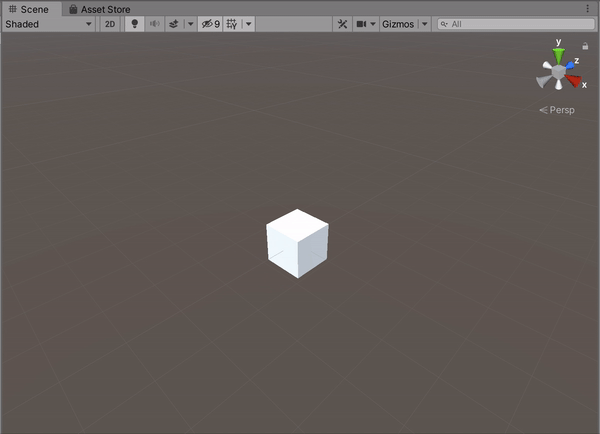

**The University of Melbourne – COMP30019 – Graphics and Interaction**

# Underbrewed

## Table of contents
* [Team Members](#team-members)
* [Introduction](#introduction)
* [How to Play](#how-to-play)
* [Graphics and Camera Motion](#using-images)
* [Shaders](#shaders-and-particle-systems)
* [Evaluation Methods](#evaluation-methods)
* [Feedback Changes](#evaluation-and-changes-implemented-changes)
* [Resource References](#resource-references)
* [Individual Contributions](#individual-contributions)


## Team Members

| Name | Task | State |
| :---         |     :---:      |          ---: |
| Arriken Worsley  | Scenes/Models     |  Done |
| Joel Kenna    | Game Logic      |  Done |
| Simon Tran  | Game Logic      |  Done |
| Iris Li  | UI      |  Done |


## Introduction

Underbrewed is a cooking simulator game, in which players must brew potions according to incoming orders. Players must collect and prepare ingredients, then add them to their cauldron in the correct order. Players must follow each recipe carefully - adding the wrong ingredient to a cauldron triggers special effects and obstacles to distract players! To earn points, players must bottle up and deliver each potion before the order expires. 

Underbrewed uses a static camera and third person perspective, and is designed to be played with a keyboard. 

## How to Play
### Basic controls
- Movement: WASD and arrow keys are both supported
- Pick up item: Press ‘M’ while facing an item
- Drop item: Press ‘M’ again while holding an item
- Throw item: Press ‘.’ While holding an item
- Interact with station: Press ‘,’ while facing the station
- Fill potion from cauldron: Press ‘,’ while holding a bottle and facing a cauldron
- Open pause menu: Press ‘Esc’
- The optional key sets "O", "P", "[" and "Z", "X", "C" can be used instead of the default "M", ",", "."

### Gameplay
Throughout a level, orders will continually arrive in the top left of the screen. Each order contains a potion, the ingredients needed to brew the potion, and a timer that indicates how long the player will have to complete the order. 

To create a potion, players must place ingredients into cauldrons in the order they appear on the recipe. If an ingredient has an icon beneath it, the player must first process the ingredient at a corresponding station before adding it to a cauldron. 

To deliver a completed potion, players must fill a bottle with liquid from the cauldron they have brewed the potion in, then must drop or throw the bottled potion through the delivery portal. Each successful delivery will increase the players’ score, which is displayed in the lower right of the screen. The time left until the level ends is displayed below the score.

If a player places an ingredient into the cauldron that does not match any valid potions, the game will trigger a special effect to distract players, such as a shader to distort the screen, or an explosion that sends ingredients flying across the scene.

<b> We recommend that new players play our tutorial level before attempting stages, as it provides an in-depth overview of the game’s controls and mechanics. </b>

## Graphics and Camera Motion

### Camera Motion
#### Third Person Static Camera
The game is primarily played with a static camera. The camera is placed high above the level, similar to a bird's eye view, allowing the player to see everything as the play they game. This camera position was chosen as it made the entire level viewable for the player while avoiding the issues of traditional cameras, such as occlusion.
<p align="center">
  
</p>

#### Action Replay Camera
When a level finishes, an "action replay" occurs, with the camera moving down towards the player and focusing on them to produce the end game screen. The camera will always approach from the opposite quarter of the level to the player in order to avoid occlusion from the level's walls.
<p align="center">
  
</p>

### Graphics Pipeline
#### Geometry shaders
* While our game doesn't contain any custom geometry shaders, the particle systems we use to create in-game effects are built using Unity's particle system functionality, which makes heavy use of geometry shaders to construct quads based on particle vertices. In our game, these systems include:
	* Bubble particle systems
	* Flame particle systems
	* Smoke particle systems

#### Fragment shaders
* Unity’s lighting fragment shaders are used throughout our scenes in order to provide realistic lighting. 
* A custom fragment shader is used to creating a rich swirling effect for our menu backgrounds and cauldron contents.
* A custom fragment shader is used to provide interesting colouring for our flame effects.

#### Post-processing
* After the initial render is complete, a custom fragment shader is applied to the initial render texture to provide post-processing effects and generate the final render texture, with this post-processing is handled through Unity's ```OnRenderImage()``` functionality. We have provided a sample of our code for applying post-processing shaders below:

```C#
    void OnRenderImage(RenderTexture source, RenderTexture destination)
    {
        if (applyAffect)
        {
            Graphics.Blit(source, destination, material);
        }
        else
        {
            Graphics.Blit(source, destination);
        }
    }
```


## Shaders and Particle Systems

### Potion Liquid Shader
The potion liquid shader, produces a swirling liquid, with the liquid slowly falling towards the center. This shader was used for the cauldron liquid, the portal center, as well as the backgrounds for the menus. The shader was produced with help from an online tutorial found [here](http://enemyhideout.com/2016/08/creating-a-whirlpool-shader/). 
<p align="center">
  
</p>

The first part of the shader is the function rotate, which rotates a point around the center by `rotationAmount` radians. This was done by coverting the initial cartesian point into a polar co-ordinates, increasing the angle by `rotationAmount` radians, and returning the point converted back into a cartesian point.
```Shaderlab
// rotates a point
float2 rotate( float rotationAmount, float2 p)
{
	float a = atan2(p.y, p.x);
	float r = length(p);

	a += rotationAmount;

	return float2(cos(a) * r, sin(a) * r);
}
```
The input uv point is first converted to be relative to the center of the uv texture, then rotated twice with the rotation function. The first rotation rotates all points by a fixed amount, while the latter rotates the points based off a mask called `motion`. This mask increases the rotation speed based of the alpha value of the mask, making the further out points rotate faster.
```Shaderlab
// find point position relative to middle of uv
float2 p = i.uv - float2(0.5, 0.5);

// if point is outside the circle, render it transparent
if (length(p) > 0.5)
{
	return fixed4(0, 0, 0, 0);
}

// For rotation

// _Swirl is general swirl amount, motion.r increases swirl amount the further out it is
p = rotate(_Rotation * _Time * _Speed, p);
p = rotate(_Swirl * (motion.a * _Time), p);
```
Finally, the rotated point is used to calculate the uv point, which is multiplied by the colour to find the final colour output. The x value of the uv is based of time offset by the inverse of the radius of the rotated point. This produces the effect the liquid falling into the center. The y value of the uv is based of the angle of the rotated point. This gives the shader the circlular texture from the initial straight vertical texture.
```Shaderlab
// For texture moving towards center
float2 uv;
        
uv.x = (_Time[0] * _Speed) - (1 / (length(p) + _Swirliness));
// angle of new point
float a = atan2(p.y, p.x);
// divide angle by two pi to get angle in radians scaled to between 0-1
uv.y = a/(3.1416 * 2);

// Now we can get our color.
fixed4 fragColor = tex2D(_MainTex, uv) * _Color;

return fragColor;
```

### Screen Distortion Shader

TODO GENERAL FLAVOUR DESC

<p align="center">
  
</p>

This shader has two main aspects, a screen shake and distortion effect and a colouring effect. 

The core of the code used to create the screen motion effects is presented below:

```Shaderlab
X = (0.05 * sin(v.vertex.x + 1.5 * sin(_Time.z)) + v.vertex.x
Y = (0.05 * sin(v.vertex.y + 2.5 * cos(_Time.z)) + v.vertex.y
```

The internal trig functions ```sin(_Time.z)``` and ```cos(_Time.z)``` are used to create a screen shake effect. The choice of using different trig functions on each axis was to ensure the screen shake didn't simply slide along a line (which would occur if the same trig functions were used on both axes). The outermost sin function was used to create a stretching / warping effect across the entire image, producing a mild sense of disorientation. Finally, to ensure the final image largely remains centred and intelligible, the distortion effect is scaled down significantly before being added to the original vertex information, causing the effect to only have a moderate effect on the final image.  

The key code used to create colouring effects is as follows:

```Shaderlab
fixed4 textureCol = tex2D(_MainTex, i.uv);

//cyclically change hue intensity
fixed4 greenCol = green * abs(sin(_Time.z));
fixed4 finalCol = 0.6 * textureCol + 0.2 * greenCol + 0.2 * green;

```
A greenish colouration is applied to the screen by retrieving the texture colour of the final image and then mixing it with a static green colour and a green colour whose strength varies with sin of the current time, resulting in a green hued image with an intensity that varies over time.


### Fire particle system

<p align="center">
  
</p>

The fire of the cauldrons and burning stations were created using Unity’s Particle System API. 

Each fire consisted of three particle systems of different sizes and colours (red, orange, and yellow sections). Using multiple particle systems helped to create the different “layers” of the fire. 

The texture used in the particle system was created by [Evgeny Starostin](https://80.lv/articles/breakdown-magic-fire-effect-in-unity/)


## Evaluation Methods

### Querying Method

#### Methodology
We used the interview querying method. Participants were sent an early version of the game, and instructed to play through a tutorial level and a game level on their own, without observation or input from the developer team. Players were invited to repeat either level as many times as they liked before taking part in an interview conducted over Zoom. The interview was recorded for future reference.

The interview consisted of open-ended questions surrounding the gameplay, graphics, and user experience. Participants were encouraged to form their own opinions of the game and discuss their feedback with the interviewer in a conversational style. Dot points and pre-prepared questions were used to guide the discussion. The interviewers took typed notes during the interviews, and reviewed audio recordings of the interviews when necessary. 

#### Participant demographic information
| Age | Gender    | Occupation                     | Self-estimate of hours of video games played per week |
|-----|--------   |--------------------------------|-------------------------------------------------------|
| 20   | Male     | 3rd year undergraduate student | 10                                                    |
| 20   | Female   | 3rd year undergraduate student | 2                                                     |
| 20   | Female   | 2nd year undergraduate student | 14                                                    |
| X   | Male   | 1st year undergraduate student | 40                                                       |
| X   | Male   | Unemployed                     | 30                                                     |

#### Strengths and weaknesses of methodology

The demographic of participants was quite narrow, with all participants being between ages 18 and 20, and undertaking tertiary education. While levels of gaming experience varied between participants, all participants had some familiarity with gaming. Participants reported playing between 2 and 14 hours of games per week. While a broader demographic in participants is generally desirable, we felt that the participants interviewed were able to use their previous gaming experience and expectations to provide relevant and insightful feedback. 

This querying method allowed participants to experience the game at their own pace and without influence from others. This method also gave participants time to reflect on their experience and concisely share their opinions. Some participants had even collated their own notes on their experience, and presented them during the interview. Participants feedback was useful in determining which aspects of the game were well-understood, and which aspects were considered pain points. However, some participants gave generic answers and struggled to recall certain elements of the game in detail when prompted. As interviewers were not present when participants were testing the game, interviewers were not able to fully capture or observe the participant's experience. 

### Observational Method
#### Methodology
We used the “Think Aloud” observational method. Participants were invited to individually live-stream their playthrough of the tutorial and first stage to the examiners through a Discord channel. Examiners remained muted during the playthrough and did not communicate with the participants. Each playthroughs was observed in real time by the examiners and was recorded for future reference and evaluation. 

#### Participant demographic information
| Age | Gender | Occupation                     | Self-estimate of hours of video games played per week |
|-----|--------|--------------------------------|-------------------------------------------------------|
| X   | Male   | Doctor of Optometry student    | 16                                                    |
| X   | Male   | 3rd year undergraduate student | 10                                                    |
| X   | Male   | 2nd year undergraduate student | 40                                                    |
| X   | Male   | 1st year undergraduate student | 40                                                    |
| X   | Male   | Unemployed                     | 30                                                    |


#### Strengths and weaknesses of methodology
The breadth of this demographic research was quite limited – all participants were either university students or planning on undertaking tertiary studies. Furthermore, all participants were male and sat within a similar age range. However, as our game is quite simple and lacks a story, we expect these factors to have little bearing on how the game is played or perceived.

Additionally, all participants had some degree of familiarity with video games. This familiarity could cause our evaluation of our game to be biased; for example, users may have played similar games before and could use their prior knowledge to supplement sections of the game where goals or mechanics were not communicated clearly. On the other hand, this familiarly meant that we could easily identify where our game failed to meet the expectations of a typical “gamer”.
Another area of weakness of our querying method was that the lack of a dialogue between the participant and examiners meant that feedback was mainly focused on the initial stumbling blocks users faced - in more collaborative methods (eg. cooperative evaluation), users can be moved forward, allowing for feedback to be provided across the entire game. However, as our users couldn't seek assistance to overcome areas of confusion, their feedback would often be limited to a subset of the game's mechanics and systems. As our tutorial was quite lacklustre when we performed our observations, we received limited feedback on later stages of the game. 

## Evaluation and changes implemented

### Gameplay
* Overall, participants stated that they found the game enjoyable and relatively bug-free, with instructions clearly stating the objective of the game, and controls working as expected
* Some participants found that the game ran at a very low frame rate (20 to 30 fps)
	* We found that certain models had a very high number of vertices. These were switched to alternate models with less vertices
* The evaluation brought attention to several minor bugs, such as players glitching through certain benches and walls, player movement being disabled after restarting the game, and the ability to generate excessive amounts of ingredients by picking items from the crate in succession
	* These bugs were fixed for the final build of the game

### Instructions / tutorial level
* While this was mentioned in the tutorial, the majority of participants were not aware that ingredients had to be added to the cauldron in a particular order to be considered “correct”. Additionally, they were unaware that certain special effects (such as ingredients exploding) were the result of adding “incorrect” ingredients to the cauldron
	* The tutorial was reworked so that tips were clearer and more precise
	* An additional stage was added to the tutorial, in which players are instructed to make an “incorrect” potion to observe the special effects
* Participants reported mixed feelings about the tutorial level. 
	* While the tutorial clearly explained the basic concepts of the game, participants felt that progression in the tutorial should be based on task completion, both to provide a sense of achievement for learning controls, and confirm that users were completing the task properly
		* The tutorial was reworked to progress based on task completion
	* Participants felt hindered by the need to always press the spacebar to continue to the next tip, and the inability to navigate back to a previous tip
		* We were unable to remove these challenges with the time given, but would like to have implemented these changes
		* Players can restart the tutorial at any time by using the pause menu
<p align="center">
	
	
	Pictured: The reworked tutorial now prompts the user to complete certain tasks in order to advance to the next step.
</p>
	
### User experience
* Some participants felt confused by the different cauldron colours, as one of the potions was very similar in colour to the colour used to represent an “incorrect” potion
	* Potion colours were changed so that a black potion represented an “incorrect” potion
	* Grey colours were used to represent different stages of the potion in the cauldron, and bright colours were used to represent the final potions
<p align="center">
	
	Pictured: A cauldron with one ingredient added and a black "incorrect" potion.
</p>

* In general, participants felt there was a lack of feedback when playing the main level, and were unsure if they had submitted a “correct” potion. Participants suggested using sound effects or visual cues to indicate to indicate if players made a mistake or submitted a “correct” potion
	* Additional sound effects were implemented, such as when an ingredient is finished processing at a station, when an incorrect ingredient is added to a cauldron, and when a potion is delivered into the portal.
* Players were required to hold down a key in order to carry an item, however many participants stated that this felt awkward
	* The mechanism for carrying an item was changed so that pressing the key would pick up or put down an item
* Some players found it difficult to align the character with certain stations or ingredients
	* To reduce the chance of this happening, we spaced out stations and ingredients
	* We also realigned some objects that were not properly aligned with the benches
* Many participants also mentioned that they felt the game would be more enjoyable with more music and sound effects, both in game, and for menus and buttons
	* Additonal sound effects were implemented for different stations and actions
	* Music was also added to the main menu and level select scenes, and sound effects were added to UI buttons
* The majority of participants felt that the main level was difficult to play, and stated that they needed more time to complete each order
	* The timing of orders were adjusted, so that more time was allowed to complete each order
* One participant felt the game would be more enjoyable if orders were created dynamically, and in response to the performance of the player (e.g. a new order could be generated if the player had completed all current orders, as opposed based on a fixed time)
	* Due to time constraints, these were not implemented, but we feel they could be implemented in a future build

### Graphics and UI
* Overall, participants felt positively about the graphics employed in the game. The graphics were often described as “cute”, and the objects and entities were relatively easy to distinguish
* Some non-interactable decorative objects were placed in the scene, however some participants felt that they might distract inexperienced players
	* Scenes were updated such that non-interactable objects appeared sparingly, and were placed more thoughtfully in the scene

### Other comments
* Some participants also suggested extra features that might suit the game such as:
	* Introducing different characters with different abilities, e.g. being able to hold multiple items at a time, or dash to move quicker
	* Have potion bottles break when dropped to increase the difficulty of the game	
		* Due to time constraints, these were not implemented, but we feel they could be implemented in a future build


## Resource References

TO DO: Statement here

## Individual Contributions

### Arriken Worsley
dot dot dot

### Joel Kenna
dot dot dot

### Simon Tran
dot dot dot

### Iris Li
dot dot dot
	
	
## References

### Logic for highscores

Logic for storing highscores locally was retrieved from the following url:

https://answers.unity.com/questions/644911/how-do-i-store-highscore-locally-c-simple.html

Pause menu and end screen: https://www.sitepoint.com/adding-pause-main-menu-and-game-over-screens-in-unity/

Fire particle system: https://80.lv/articles/breakdown-magic-fire-effect-in-unity/ 

Button animation: https://www.youtube.com/watch?v=CJ8FKjYtrT4


### Sound effects

Game background music: https://www.youtube.com/watch?v=iX6ex5fYT7o

Screen effect sound: https://www.youtube.com/watch?v=vJz54_quoow

Menu background music: https://www.youtube.com/watch?v=rsEeiIrJy4E

Pick up sound: https://freesound.org/people/pogmothoin/sounds/401722/

Bad effect sound: https://freesound.org/people/GabrielAraujo/sounds/242503/

Missed order sound: https://freesound.org/people/themusicalnomad/sounds/253886/

Tutorial complete sound: https://freesound.org/people/deleted_user_877451/sounds/76426/

Menu buttons sound: https://freesound.org/people/Christopherderp/sounds/342200/

Order complete sound: https://freesound.org/search/?q=bwg2020+correct

Cauldron bubbling: https://freesound.org/people/lonemonk/sounds/108746/

Station finish sound: https://www.youtube.com/watch?v=QDKBDduuJ_0

Level dings: https://www.youtube.com/watch?v=R6F0ysJIeHQ

Mortar and pestle sound: https://www.youtube.com/watch?v=PJo5yIPhFSM

Chopping sound: https://www.youtube.com/watch?v=BrDkL5Y7kCs

Game trailer music: https://www.youtube.com/watch?v=v4pTPigj0Gk


### Textures, materials, and 3D models

Flower model: https://free3d.com/3d-model/hinduismlotus-flower-v1--463468.html

Outside decoration: https://assetstore.unity.com/packages/3d/environments/fantasy/free-cartoon-halloween-pack-mobile-vr-45896

Outside decoration: https://assetstore.unity.com/packages/3d/environments/fantasy/halloween-cemetery-set-19125

Cheese model: https://www.cgtrader.com/items/258230/download-page

Eye model: https://www.cgtrader.com/items/44082/download-page

Bone model: https://poly.google.com/view/9KOTx3n2lfm

Book model: https://poly.google.com/user/6WNlPxHAo7o

Potion model: https://poly.google.com/view/dOREefQfDQu

Knife model: https://poly.google.com/view/0X5xcxjszwI

Cauldron design reference: https://www.youtube.com/watch?v=x-6cvNjUuAI

Bubbles design reference: https://www.youtube.com/watch?v=ajsA6vWBhKI

Pick up script design reference: https://www.youtube.com/watch?v=90OiysC4j5Y

Bin model: https://www.turbosquid.com/3d-models/free-c4d-mode-m%C3%BClleimer-bin/483718
 
Squashed eye model: https://www.turbosquid.com/3d-models/3d-rectangle-flow-splash-model-1213683

Chopped cheese model: https://www.turbosquid.com/3d-models/free-max-mode/1033609

Crate and candle models, wall texture: https://assetstore.unity.com/packages/3d/environments/fantasy/mega-fantasy-props-pack-87811

Crushed rock model: https://www.turbosquid.com/3d-models/rock-pile-obj-free/813686

Chopping board model: https://www.turbosquid.com/3d-models/free-chopping-board-3d-model/538266

Frog model: https://www.turbosquid.com/FullPreview/Index.cfm/ID/753743

Fire particle system texture: https://80.lv/articles/breakdown-magic-fire-effect-in-unity/ 

Fire station model: https://www.turbosquid.com/3d-models/pit-firepit-3ds/701220

Interior decorations: https://poly.google.com/user/4aEd8rQgKu2

Ladder model: https://poly.google.com/user/a4-Oxy9dNsF

Witch hat: https://free3d.com/3d-model/witchhat-v4--231135.html

Wood texture: https://www.pinterest.com.au/pin/14496030030351650/


### Sprites

Ingredients: https://clipartmax.com/ 

Potions: Benjamin Czapla (student work)

Scroll: https://www.clipartkey.com/

Stations: https://clipart-library.com/ 


## Technologies
Project is created with:
* Unity 2019.4.3f1
* Ipsum version: 2.33
* Ament library version: 999

## Using Images

You can use images/gif by adding them to a folder in your repo:

<p align="center">
  
</p>

To create a gif from a video you can follow this [link](https://ezgif.com/video-to-gif/ezgif-6-55f4b3b086d4.mov).

## Code Snippets 

You can include a code snippet here, but make sure to explain it! 
Do not just copy all your code, only explain the important parts.

```c#
public class firstPersonController : MonoBehaviour
{
    //This function run once when Unity is in Play
     void Start ()
    {
      standMotion();
    }
}
```


